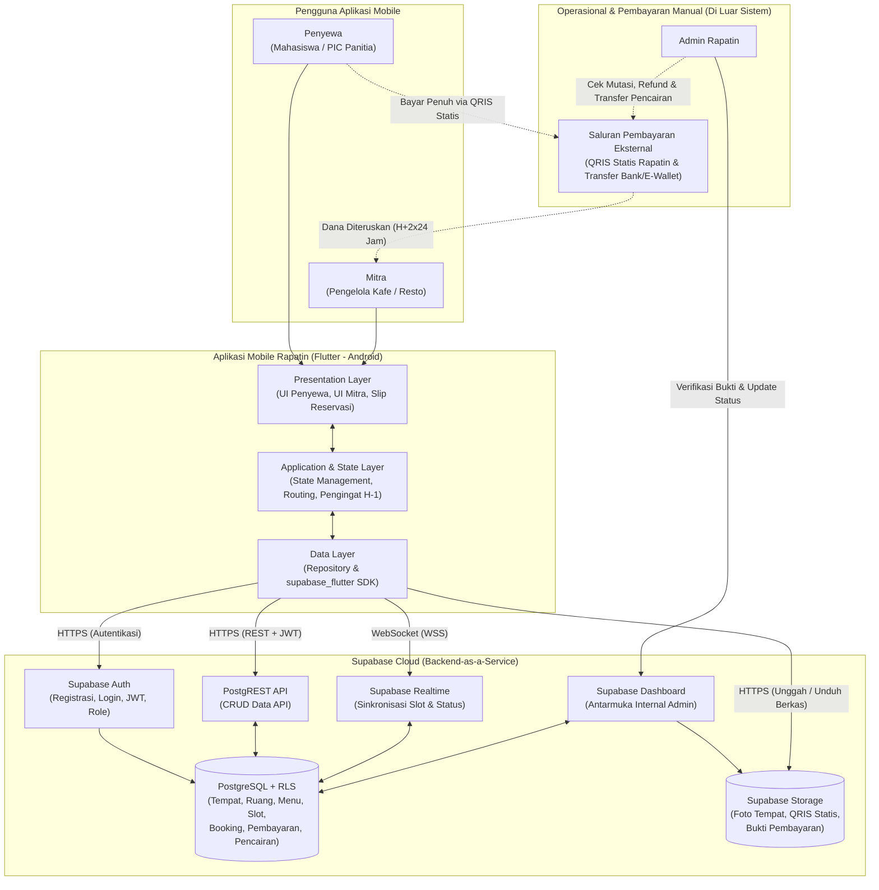

```mermaid
flowchart TB
    subgraph Users["Pengguna Aplikasi Mobile"]
        P["Penyewa<br/>(Mahasiswa / PIC Panitia)"]
        M["Mitra<br/>(Pengelola Kafe / Resto)"]
    end

    subgraph Mobile["Aplikasi Mobile Rapatin (Flutter - Android)"]
        UI["Presentation Layer<br/>(UI Penyewa, UI Mitra, Slip Reservasi)"]
        SM["Application & State Layer<br/>(State Management, Routing, Pengingat H-1)"]
        REPO["Data Layer<br/>(Repository & supabase_flutter SDK)"]
        UI <--> SM
        SM <--> REPO
    end

    subgraph Supabase["Supabase Cloud (Backend-as-a-Service)"]
        AUTH["Supabase Auth<br/>(Registrasi, Login, JWT, Role)"]
        API["PostgREST API<br/>(CRUD Data API)"]
        RT["Supabase Realtime<br/>(Sinkronisasi Slot & Status)"]
        DB[("PostgreSQL + RLS<br/>(Tempat, Ruang, Menu, Slot,<br/>Booking, Pembayaran, Pencairan)")]
        ST[("Supabase Storage<br/>(Foto Tempat, QRIS Statis,<br/>Bukti Pembayaran)")]
        DASH["Supabase Dashboard<br/>(Antarmuka Internal Admin)"]

        AUTH --> DB
        API <--> DB
        RT <--> DB
        DASH <--> DB
        DASH --> ST
    end

    subgraph External["Operasional & Pembayaran Manual (Di Luar Sistem)"]
        ADM["Admin Rapatin"]
        PAY["Saluran Pembayaran Eksternal<br/>(QRIS Statis Rapatin & Transfer Bank/E-Wallet)"]
    end

    P --> UI
    M --> UI

    REPO -- "HTTPS (Autentikasi)" --> AUTH
    REPO -- "HTTPS (REST + JWT)" --> API
    REPO -- "WebSocket (WSS)" --> RT
    REPO -- "HTTPS (Unggah / Unduh Berkas)" --> ST

    ADM -- "Verifikasi Bukti & Update Status" --> DASH
    P -. "Bayar Penuh via QRIS Statis" .-> PAY
    ADM -. "Cek Mutasi, Refund & Transfer Pencairan" .-> PAY
    PAY -. "Dana Diteruskan (H+2x24 Jam)" .-> M
```